# Session policies: the UI

Track D of [the session-policies plan](plans/2026-10-02-session-policies-tracks.md).
Built against [`contracts/policy/backend-api.yaml`](contracts/policy/backend-api.yaml);
without a backend it runs against a mock of that contract.

A policy decides what an agent connected over MCP may do in the browser, on
the desktop and in the shell: it is asked about every tool call
(`browser_execute` and `desktop_execute` on server `browser`; `exec`,
`stream_logs`, `search_logs` and `kill` on server `exec`). It is a Rego module and
nothing else. There is no JSON form, no format switch, no generated-Rego
pane and no schema: `kind` is still sent, and its only value is `"rego"`.

## Pages

| Route | What | Cloudscape pattern |
|---|---|---|
| `/` | Sessions, with a Policy column and an "as code" tag | table view (as before) |
| `/sessions/create` | Name (pet-name placeholder) and the policy | [single page create](https://cloudscape.design/patterns/resource-management/create/single-page-create/); the policy is a [sub-resource create](https://cloudscape.design/patterns/resource-management/create/sub-resource-create/): embedded radios for the ready-made choices (the presets, copy from a session, write a policy, managed as code), a split panel for writing one |
| `/sessions/:id` | Title row, then Browser and Policy tabs (`?tab=policy`) | [details page with tabs](https://cloudscape.design/patterns/resource-management/details/details-page-with-tabs/) |
| `/sessions/:id/policy/edit` | The editor; read-only when managed as code | [page edit](https://cloudscape.design/patterns/resource-management/edit/page-edit/) |
| `/tokens`, `/tokens/create` | API tokens; the secret shown once | table view, single page create |

Leaving a page with changes raises the Leave page modal of
[communicating unsaved changes](https://cloudscape.design/patterns/general/unsaved-changes/)
(`web/src/useUnsavedChanges.tsx`), and `beforeunload` for the browser's own
navigation. With nothing changed there is no modal.

## Where the design's pattern table was adjusted

The design read the pattern pages through a summary. Read directly, they say
a few things it did not, and the UI follows the pages:

- **Page edit**: the button is "Save [object]" ("Save policy", not "Save").
  Saving with no changes returns to the page the edit started from with an
  info flashbar, "No changes were made to the policy."
- **Unsaved changes**: no modal "when there is no risk of data loss". Cancel
  on an untouched form leaves at once; the design had "Cancel with anything
  entered", which is the same thing said the other way.
- **Single page create / page edit**: "Don't disable the primary button".
  Create and Save are always enabled; what is missing is said on the field.
- **Sub-resource create**: "Don't use a modal for sub-resource creation".
  Writing a policy is in the split panel; modals are used only for
  confirmations and for the two-field management setting.
- **Code editor** (the component's usage page): "Don't use the code editor
  component to display non-editable code snippets". The read-only views (the
  Policy tab, the policy in force, a policy managed as code) are plain code
  blocks, not Monaco. The design had Monaco read-only for "View source". This
  also keeps Monaco off the session page. Its other guidance is followed too:
  a status bar (language, cursor, error and warning counts), a problems pane,
  a loading state and an error state for the editor, and the editor is never
  in a modal. There is no preferences modal.
- **Details page with tabs**: the summary container is optional. The session's
  title row (state, created, Copy MCP URL: PR #41 moved them there and removed
  the Details box) is the summary that stays in view; the policy's one-line
  state is added to it rather than bringing a box back.

## Managed as code

Per session's policy, as in the design (section 2.3) and like Tailscale's
policy file when it is managed by GitOps:

- The list and the session's title row carry an "as code" tag.
- The Policy tab shows an alert, "This policy is managed as code", with the
  link (`management.managed_url`) and "Manage here instead". Edit, Reset and
  Copy from session are absent; "View source" opens the edit route read-only.
- `/sessions/:id/policy/edit` opened directly shows that read-only view (the
  source and Test, which saves nothing), not an error.
- "Manage here instead" opens the management modal on "This editor"; saving
  it (`PUT …/policy/management`) returns the write actions. There is no
  "edit anyway".
- A save refused with 409 because the mode changed while the editor was open
  says so, shows the link from the answer, and offers Reload.

## When the backend has the feature off

The backend ships policies behind `POLICY_OPERATOR_URL`. With it unset the
sessions carry no `policy` and the policy endpoints are not routed (404).
The UI then shows nothing of the feature and no errors: no Policy column, no
tabs (the browser is the whole session page), a create page with the name
alone that sends `{"name": …}` as before, and no "API tokens" link unless
`/tokens` answers. `ifAvailable` in `web/src/policyApi.ts` is the one place
that decides; a signed-out proxy is still treated as signed out.

## The editor

Monaco from the npm package (`monaco-editor`), never a CDN: the editor core
and its one worker are built into the app's own assets
(`web/src/policy/monaco.ts`). No bundled language is loaded: Rego
highlighting is a Monarch grammar (`web/src/policy/rego.ts`), and every
problem comes from `/policies/validate`, 400 ms after the last keystroke.
It is a lazy chunk, fetched only when a policy is edited.

The workbench (`web/src/components/PolicyWorkbench.tsx`) is the same on the
create page's split panel and on the edit page:

- **Start from a preset** replaces the text with a preset's Rego. The edit
  page also has **Copy from session**.
- **policy.rego**, the editor. A policy written from nothing starts from
  `REGO_TEMPLATE` (`rego.ts`): browser operations only, with a comment that
  says `desktop_execute` and the `exec` server's tools are refused until a
  rule allows them, and that restricting the browser while allowing desktop
  control or the shell can be walked around.
- **The status bar** (Rego, cursor, error and warning counts, Checking or
  Valid) and **the problems pane**. A diagnostic with a row is also a marker
  in the editor. A diagnostic without one is in the problems pane alone:
  the warnings `browser_bypass_desktop`, `browser_bypass_shell` and
  `shell_bypass_desktop` are about the policy as a whole (one tool is
  restricted, another that can walk around it is left open) and have no
  position. A warning does not stop a save; the Policy tab shows the saved
  policy's warnings in an alert, and the create page's summary counts them
  ("Rego · 12 lines · valid, 1 warning").
- **Test** runs the text in the editor against a call
  (`/policies/evaluate`) and saves nothing. It answers as a session would:
  a server and tool the platform does not know are denied whatever the
  policy says.

The source is the module, so there is one pane. The exception is a saved
source that does not compile: the last one that did is still in force
(`policy.rego`), and the Policy tab and the read-only view show it under
the source as "Policy in force".

"No restrictions" is said of exactly one module: the `unrestricted` preset,
whatever its comments and spacing (`isUnrestricted` in
`web/src/policyApi.ts`). The text is "an agent may use the browser, the
desktop and the shell".

### Presets

From `GET /policy-presets`: the files `contracts/policy/examples/<id>.rego`.
The title is the id with spaces and a capital; the description is the
comment the file begins with. The first is selected when the create page
opens.

| Preset | What it allows |
|---|---|
| Unrestricted | Everything: the browser, the desktop, any shell command |
| Browser only | Every browser operation; no desktop control, no shell |
| Form filling | Forms on two sites: printable text, a few keys, sane viewport sizes, no script |
| No scripting | The browser except running script in the page or replacing its content |
| Observe only | Open https pages, wait, take screenshots |
| One site | example.com and its subdomains only, short text only |
| Read-only shell | The browser, and a short list of read-only shell commands; no desktop control |

### Sample calls

The Test panel's select, grouped by server and tool
(`web/src/policy/samples.ts`). The call is an editable JSON text: it is the
`input` a policy sees.

| Group | Samples |
|---|---|
| browser / browser_execute | Sign in on a page; Navigate to a URL; Take a screenshot; Run script in the page; Navigate to another site |
| browser / desktop_execute | Take a screenshot of the desktop; Click and type on the desktop; Press a key combination; Read the clipboard |
| exec / exec | Run git status; Run a program that talks to the browser's debugging port; Run a shell |
| exec / stream_logs | Read a command's output |
| exec / search_logs | Search a command's output |
| exec / kill | Stop a command |
| browser / file_write | A tool that does not exist |

## Developing without a backend

```
cd web
nix develop -c npm run dev:mock        # every feature on
MOCK=off nix develop -c npx vite       # a backend with the feature off
```

`web/mock/backend.ts` answers `/api` as `backend-api.yaml` says, with the
contract's examples (`examples/*.rego`) as presets, and seeds a session in
each policy state: `research` (one-site, editor, in force), `scratch`
(unrestricted), `ci-runner` (observe-only, managed as code), `just-saved`
(loading), `broken` (a source that does not compile over form-filling, which
is still in force), `from-before` (unsupported). The component tests run
against the same mock.

It does not compile or run Rego (see the comment at its top):

- `validate` knows three things: the package clause, a call to `http.send`
  (an error with a position) and a module without `allow_tool_call` (a
  warning). A module that looks at the browser's operations and names the
  `exec` server or `desktop_execute` gets a bypass warning without a
  position, so that path of the UI can be seen.
- `evaluate` denies a server and tool the platform does not know. For a
  preset, unedited, and a call that is one of its cases
  (`examples/<id>.cases.json`), it answers what the case says. Anything else
  gets a placeholder, not the policy's answer: the unrestricted module
  allows, every other module allows `browser_execute` only. The desktop and
  shell samples and the tool that does not exist are cases of the presets
  ("Read the clipboard" is not, and read-only-shell has no case for two of
  the desktop ones; the placeholder denies those, as the policies would).
  The browser samples are not cases, so against the mock every policy
  allows them: use a real backend to see a browser rule refuse a call.

## Screenshots

From the mock, in headless Chrome: [`policy-ui/`](policy-ui/).

They were taken when a policy could also be written as JSON, and have not
been retaken. Stale, because they show the JSON form, the JSON/Rego switch,
the generated-Rego pane, the old preset list or the old "browser
operations" wording:

- `01-list.png`: the Policy column says "JSON, v1, in force".
- `02-create.png`: five presets (the first titled "No restrictions"; there
  are seven now, the first titled "Unrestricted") with the old descriptions,
  "In JSON or in Rego", and the old description of a policy.
- `04-create-panel-errors.png`: the format switch, a JSON policy and its
  generated Rego in the split panel.
- `06-detail-policy.png`: kind JSON, two panes, the old description.
- `07-detail-policy-iac.png`: the old description; the source shown is the
  old observe-only example.
- `08-management-modal.png`: the modal is as it is; the page behind it is
  the one in 07.
- `11-edit.png`: the format switch, the JSON editor, the generated Rego.
- `13-edit-rego.png`: the format switch above the Rego editor; no presets
  button; the old sample list.
- `14-edit-readonly.png`: the old observe-only example as the source.
- `17-created-flash.png`: the title row says "JSON, v1, loading".
- `19-leave-modal.png`: the modal is as it is; the page behind it is the
  JSON editor with its generated Rego.

Not looked at again, and not about policies: `16-token-created.png`.

| | |
|---|---|
| 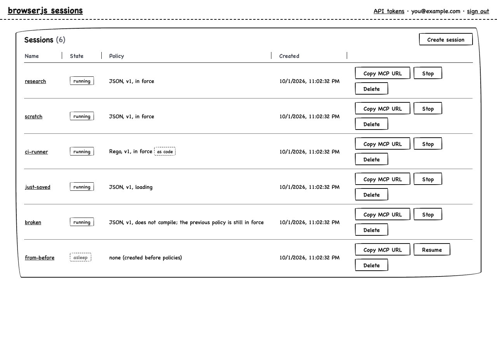 | 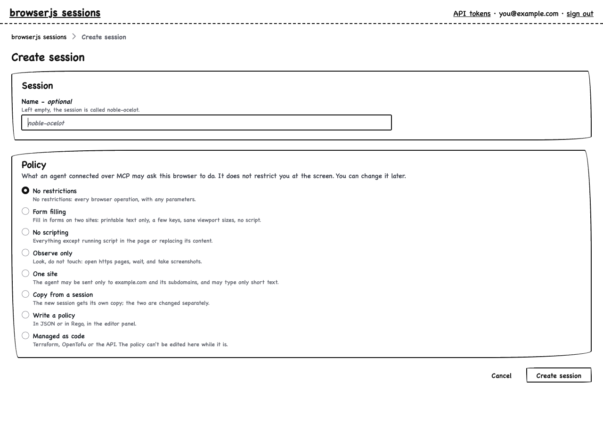 |
| 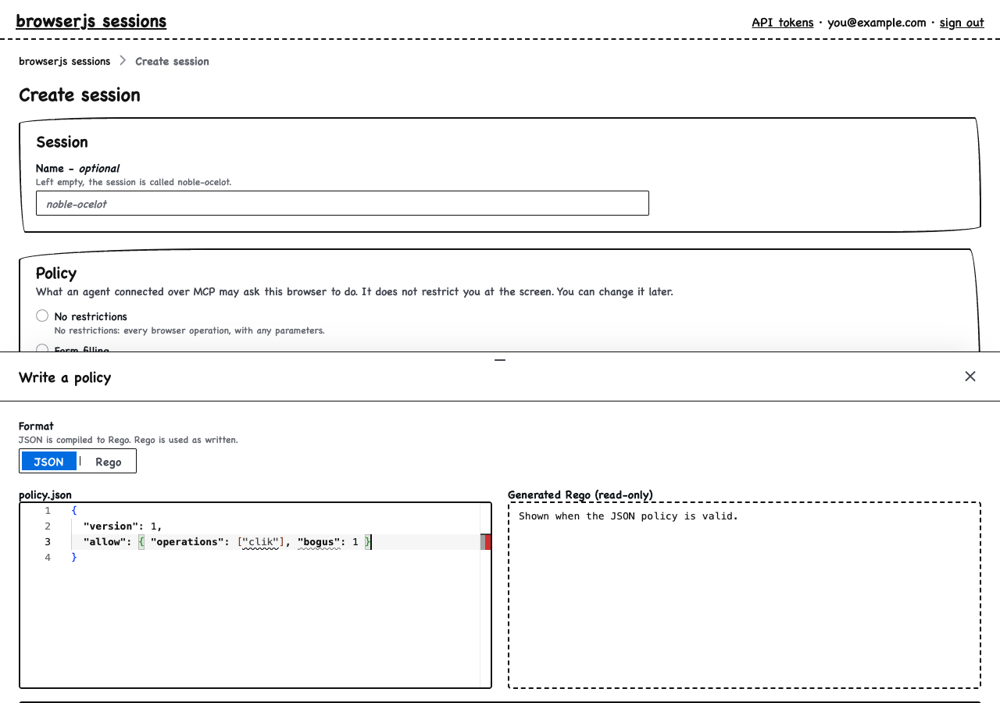 | 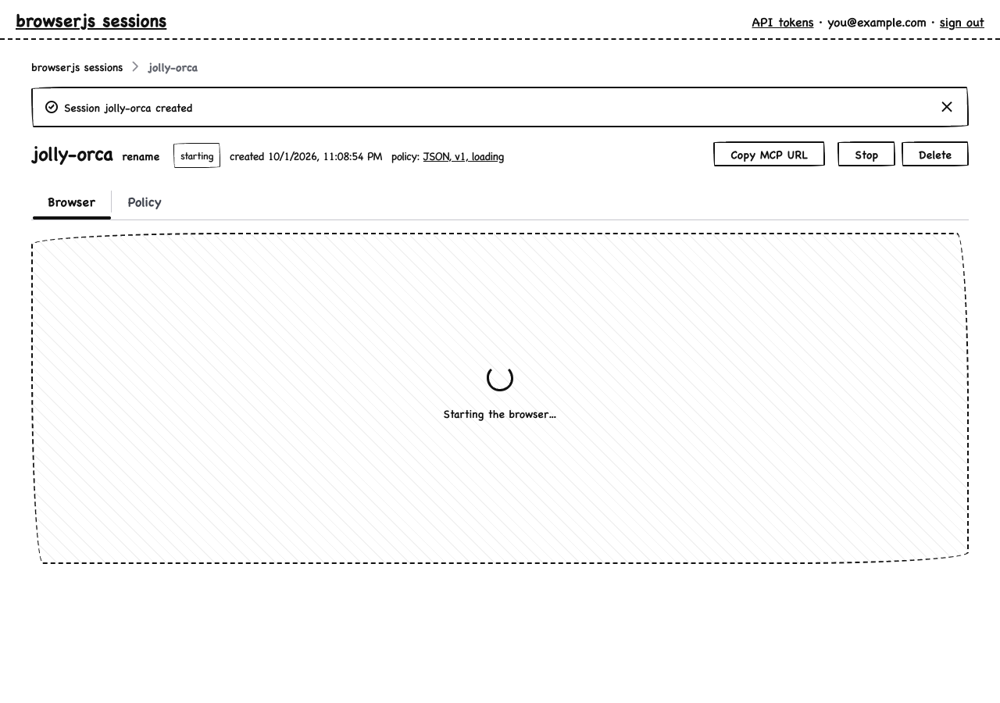 |
| 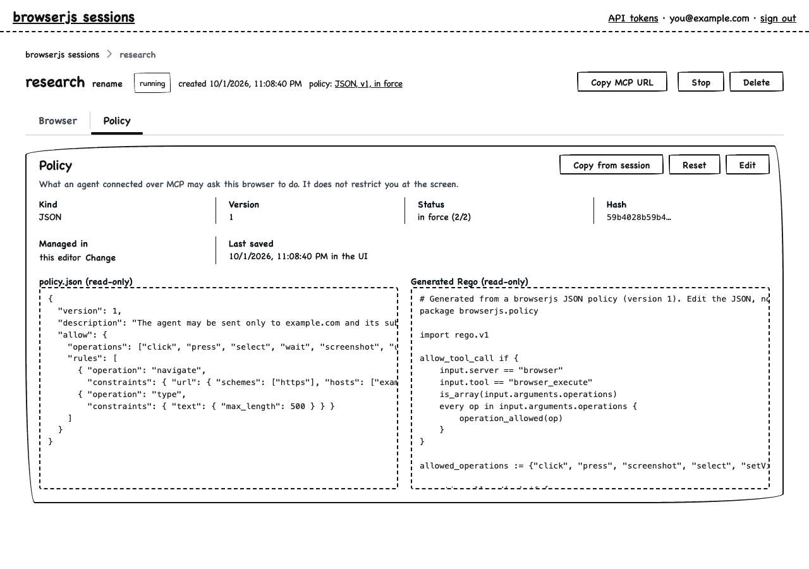 | 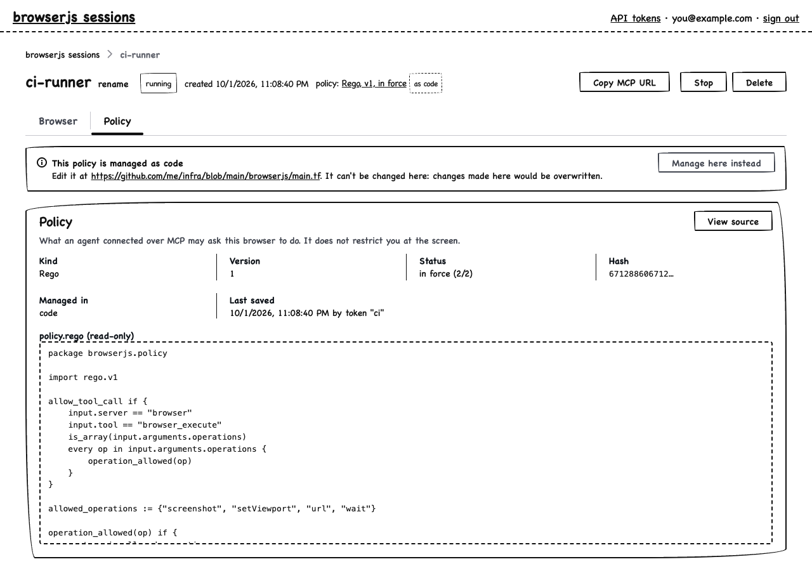 |
| 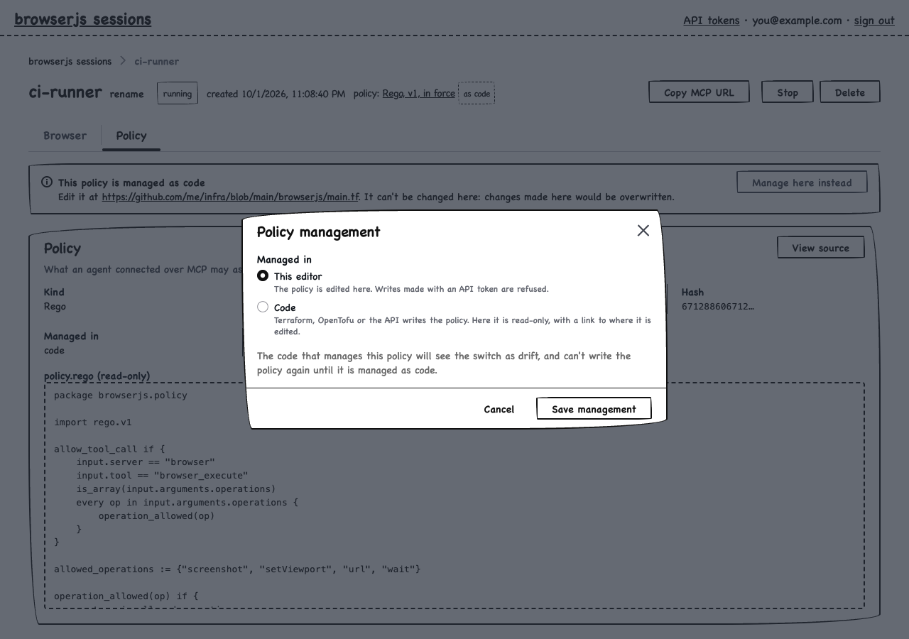 | 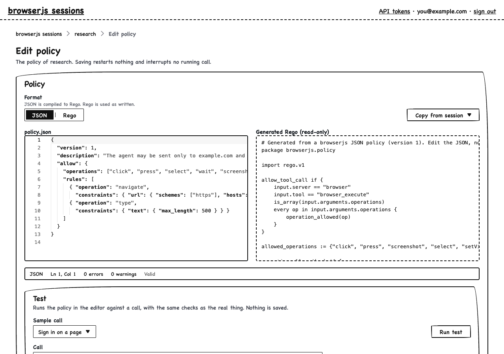 |
| 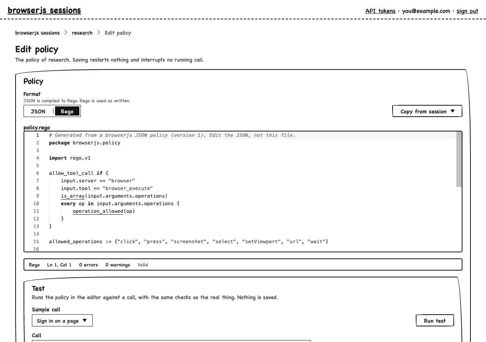 | 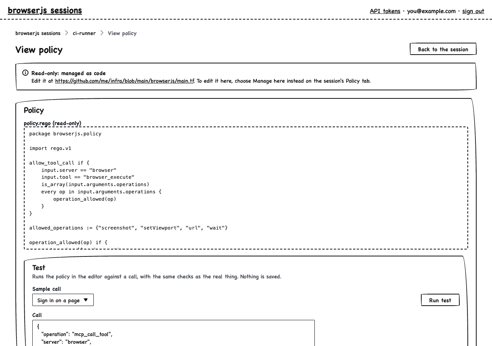 |
| 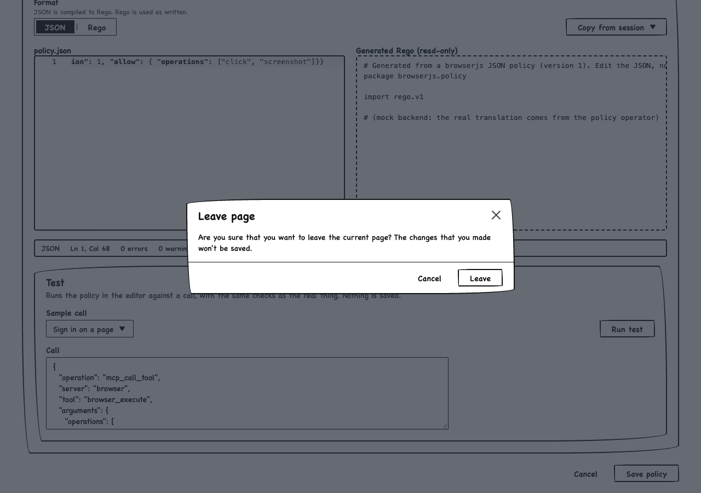 | 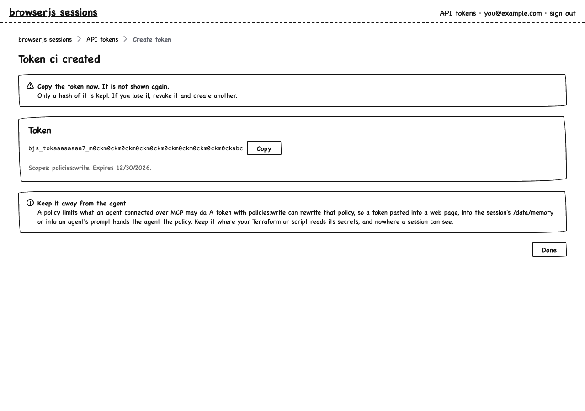 |
